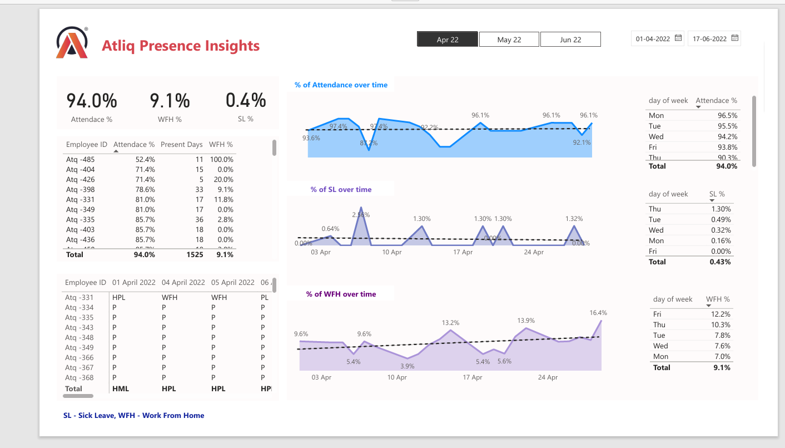

# HR Analytics Dashboard

The HR Analytics Dashboard is a tool designed to provide insights into various HR metrics and trends. This dashboard enables HR professionals to make data-driven decisions by visualizing key performance indicators related to employee demographics, performance, turnover, and more.

## Features

- **Employee Demographics:** Visualize the composition of the workforce by age, gender, department, and role.
- **Performance Analysis:** Track employee performance over time, identify high performers, and understand performance distribution across the organization.
- **Turnover Insights:** Analyze employee turnover rates, identify patterns, and assess the impact on the organization.
- **Compensation and Benefits:** Review salary distributions, benefits uptake, and compensation trends.
- **Recruitment Metrics:** Monitor recruitment efficiency, including time-to-hire and cost-per-hire.

## Installation Prerequisites

1. Ensure you have [Power BI Desktop](https://www.microsoft.com/en-us/download/details.aspx?id=58494) installed on your machine.
2. Download the Project:
   - Download the `HR_Analytics_Atliq.pbix` file from the repository or the provided source.
3. Open the Project:
   - Launch Power BI Desktop.
   - Open the downloaded `.pbix` file by selecting `File` -> `Open` and navigating to the file location.
4. Data Refresh (Optional):
   - If the dataset is connected to a live data source, refresh the data by clicking on `Home` -> `Refresh`.
5. Customize (Optional):
   - Modify any visualizations or settings as per your requirements.
   - Save the changes by selecting `File` -> `Save`.

## Usage

- Navigate through the different tabs of the dashboard to explore various HR metrics.
- Use filters and slicers to drill down into specific data points.
- Export visualizations and reports as needed for presentations or further analysis.

## Contact

For any queries or support, please contact Abhishek Singh Tomar at [officialabhitomar@gmail.com](mailto:officialabhitomar@gmail.com).

Dashboard.png
